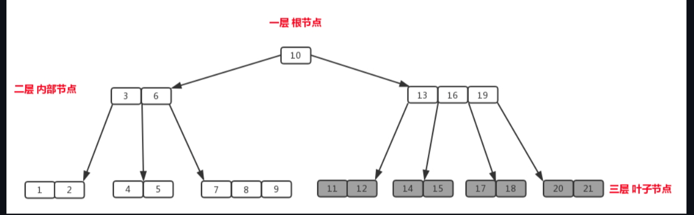
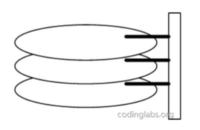
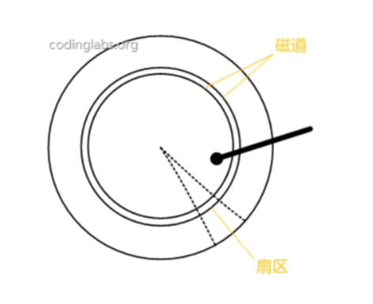
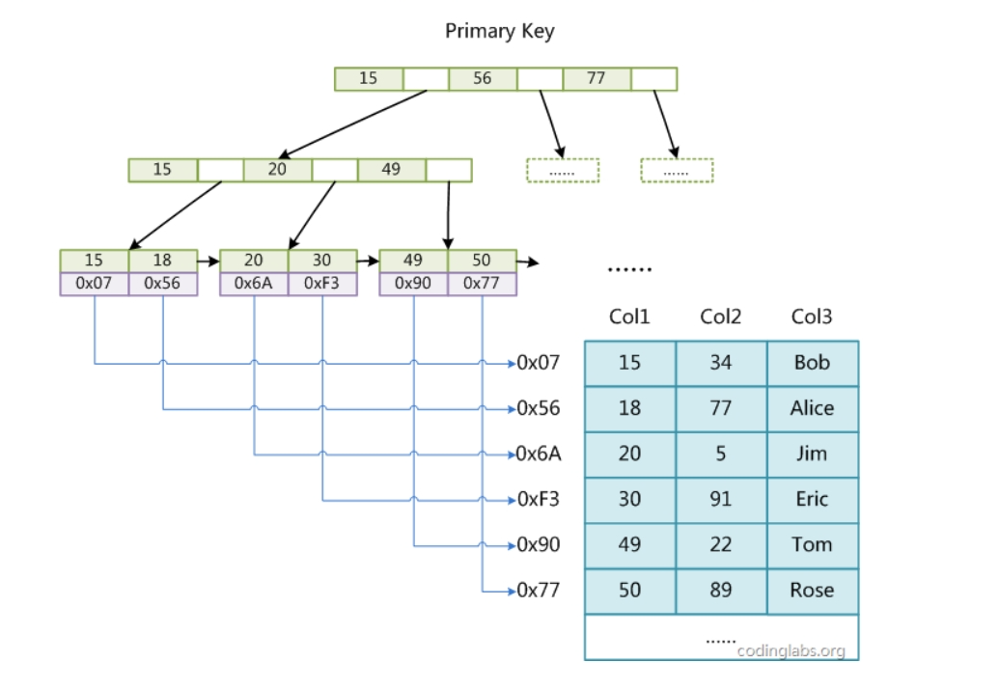

---
authors:
  - shaoxiawjc
date: 2024-02-11
tags:
  - mysql
categories:
  - Java
  - mysql
---

# MySQL的索引

# 一、搜索树

## 1、二叉搜索树

二叉搜索树（Binary Search Tree，简称BST）是一种二叉树数据结构，具有以下性质：

1. **有序性：** 对于二叉搜索树中的每个节点，其左子树中的所有节点的值都小于该节点的值，而右子树中的所有节点的值都大于该节点的值。
2. **递归性：** 二叉搜索树的左子树和右子树也是二叉搜索树。

<!-- more -->

这两个性质保证了在二叉搜索树中进行查找、插入和删除等操作时的高效性。由于有序性，可以利用二分查找的思想进行快速搜索。

以下是一个简单的二叉搜索树的示例：

```markdown
      5
     / \
    3   8
   / \ / \
  2  4 6  9
```

在这个示例中，树中的每个节点都遵循二叉搜索树的有序性。对于任意节点，其左子树中的值都小于节点的值，而右子树中的值都大于节点的值。

### 操作：

1. **查找：** 从根节点开始，比较要查找的值与当前节点的值，根据比较结果沿着左子树或右子树递归查找。
2. **插入：** 从根节点开始，根据要插入的值的大小，递归地在左子树或右子树中找到合适的位置插入新节点。
3. **删除：** 删除节点时需要考虑不破坏二叉搜索树的有序性。分为三种情况：
   - 如果节点没有子节点，直接删除即可。
   - 如果节点有一个子节点，将其父节点指向子节点。
   - 如果节点有两个子节点，可以选择用其右子树中的最小值节点替换该节点，然后在右子树中删除这个最小值节点。

二叉搜索树的平均时间复杂度为O(log n)，其中n是树中节点的数量。但在最坏情况下，当树高度接近n时，时间复杂度可能退化为O(n)。因此，为了确保平衡性，人们引入了平衡二叉搜索树的概念，例如B/B+树和红黑树。这些树在插入和删除节点时保持平衡，提高了查找等操作的性能。

## 2、B-Tree

### 2.1定义

B树是一种平衡的多叉树，我们一般叫m阶B树，它必须满足以下性质

* 每一个节点最多只有m个节点
* 每个内部节点（除了根节点和叶子节点）都至少具有[m/2]个子节点
* 如果根不是叶节点，则根至少有俩个节点
* 具有k个子节点的非叶节点有k-1个键
* 所有叶子节点的高度一致

**B树的阶**

也就是我们上面所说的m，是一个节点的子节点的个数的最大值

比如下图的【13 16 19】的子节点个数达到了4，就是m



**根节点**

如图中的【10】就是根节点，这个还是比较直观的。

当然，根节点可以不止一个，对于一个m阶的B树，其根节点满足：

* 2 <=  M <= m  其中 M 为子节点数量
* 1 <=  K  <= m-1 其中 K 为根节点的元素个数

以上的关系式还是比较好理解的，可以有上面的B树的定义4得来

**内部节点**

除了根节点换个最下面的节点，比如图的 【3 6】【13 16 19】

假设m阶B树的内部节点的子节点数量为M，则有

* [m/2]+1<= M <=m

对应的元素个数K=M-1

满足

* [m/2]<= K <=m-1

这里讲一下为什么又这个关系式。==**个人理解：**==首先这个关系式是为了保持B树的“矮胖”，想象一下，有一颗茂盛的100阶B树，假设它有100个高度。接下来你要对它进行删除操作，如果不考虑上面的关系式，那么你最后是可以把它删成每一个节点只有1个数据的100层

的B数，但其实它是完全可以向上合并的。

**叶子节点**

最下面的节点，由于其不含字节点，因此只需满足

* [m/2]<= K <=m-1

K 为元素个数


## 3、磁盘存储和预读

计算机存储一般分为俩种：内存和外存

众所周知，内存的时间是远远大于外存的，但是内存的贵而且断电即失

而外存，一般是磁盘存储，其时间之所以慢，是因为内存使用电，而磁盘使用机械运动，磁盘花在存储上的时间由3部分组成，分别为寻道时间，旋转延迟和传输时间

* 寻道时间和旋转延迟






如上俩张图，圆圆的是磁盘，黑黑的长长的是磁头，当我们需要从磁盘里读取数据时，操作系统会发送数据逻辑地址给磁盘，C盘将其转化为物理地址，就是哪一个磁道，然后把磁头放上去读，那么磁头放上去所花费的时间，我们就称为**寻道时间**，一般在5ms以下，然后磁盘旋转将目标扇区转到磁头下面所花费的时间称为**旋转延迟**，一般在4ms左右

* 传输时间

指的是得到数据把它从磁盘里读出去，或者把数据写进去的时间，一般只有0.几ms，相对于上面俩位大哥可以忽略不计

那么5+4=9ms，如果在MySQL里执行上百万条数据，重复这样的过程会非常的耗时

考虑到磁盘IO是非常高昂的操作，计算机操作系统做了一些优化，当一次IO时，不光把当前磁盘地址的数据，而是把相邻的数据也都读取到内存缓冲区内，因为局部预读性原理告诉我们，当计算机访问一个地址的数据的时候，与其相邻的数据也会很快被访问到。每一次IO读取的数据我们称之为一页(page)。具体一页有多大数据跟操作系统有关，一般为4k或8k，也就是我们读取一页内的数据时候，实际上才发生了一次IO，这个理论对于索引的数据结构设计非常有帮助。

从上我们可以得出

* 我们要少查磁盘
* 磁盘读1K和1B的时间差不多

假设我们一次I/O的查询量为8K，索引使用int4字节存储，一个节点最多2000条数据，那么我们考虑三层B树，总共大约有

2000 * （2000+1）*（2000+3）= 80亿条数据，而3层我们只需查3次I/O，由此可见B树的强大之处


## 4、B+树

B+树的特征

* 有m个子节点的中间节点包含m个元素（和B树不一样，B树是m-1个）==请注意，这一点在很多地方是有争议的，有些地方认为B+树的非叶子节点元素个数仍然是m-1个==
* 每个元素不包含数据，只拿来做索引
* 叶子节点包含了全部关键字的信息和指向数据的指针，并且叶子节点本身按照关键字大小顺序排序
* 所有的非终端节点都可以看成索引部分，节点里的元素可以看出对应子节点是大于还是小于

关于B+树的插入和删除可以参考上面的博客

**为什么说B+树更适合做数据库索引**

1. B树的非叶子节点不存储数据了，那么空间就大了，相对于B树就可以存储更多的关键字了，那么树的高度就降低了，提高了检索的效率
2. 查询效率稳定。每次查询一棵B+树一定要走到叶子节点，也就是说每次的查询时间差不多
3. 便于范围查询，由于B+树的叶子节点是一个有序的链表，我们在查询到一个上限或下限关键字后，可以直接遍历来查询。而B树必须一次一次的查询


# 二、MySQL索引实现

## 1、MyISAM索引实现



MyISAM使用B+数作为其索引的数据结构，其中叶子节点存储的是对应数据的物理地址

我们由之前的磁盘存储原理可知，MyISAM在查询到地址后还要重新寻道旋转，具体过程如下：

1. **索引的读取：** 查询开始时，MyISAM 存储引擎会首先读取索引树，这是一个 B 树结构，树的节点包含了索引键值和指向下一级节点的指针。这一步操作通常需要进行多次 I/O 操作，尤其是在树的深度较大的情况下。
2. **定位叶子节点：** 一旦找到了包含目标索引键值的叶子节点，MyISAM 会再次进行 I/O 操作，将叶子节点读入内存。
3. **获取物理地址：** 叶子节点中存储了数据行的物理地址（磁盘上的位置）。MyISAM 会从叶子节点中获取这些物理地址。
4. **磁盘 I/O 操作：** 最后，MyISAM 需要进行一次或多次磁盘 I/O 操作，以从磁盘上读取或写入实际的数据行。这可能涉及到寻找磁头、寻道、旋转等磁盘操作。

因此，MyISAM的查询会经过多次I/O操作，很影响性能，所以我们不用

**MyISAM的辅助索引**

MyISAM的辅助索引使用的是B+树数据结构，但是MyISAM的辅助索引是可以重复的（这里注意一点，B+树是可以重复数据的，使得对应叶子节点的元素会存储多个数据行），其中叶子节点的data存放的是主键的物理地址，myisam在查询数据时是先查找辅助索引，查询到主键后，在查找对应的数据


## 2、InnoDB索引实现

InnoDB的索引也是使用B+树实现的，与上面那位不同的是，InnoDB的叶子节点的数据存放的是一整个数据行


可以看到，InnoDB的数据是按主键聚集的，因此InnoDB的索引也叫聚集索引，上面那位叫非聚集索引。因此InnoDB必须要有主键，如果没有，MySQL会自己创建一列6位的长整型来当做主键

**InnoDB的辅助索引**

和上面那位不同的是，InnoDB的辅助索引存储的是主键的值而不是地址。

InnoDB使用辅助索引查询需要检索俩次：先检索辅助索引获得主键，在检索主键获得数据


# 参考链接


https://blog.codinglabs.org/articles/theory-of-mysql-index.html

https://github.com/wardseptember/notes/blob/master/docs/B%E6%A0%91%E5%92%8CB+%E6%A0%91%E8%AF%A6%E8%A7%A3.md

https://juejin.cn/post/6990616210895273991

https://zhuanlan.zhihu.com/p/54102723


