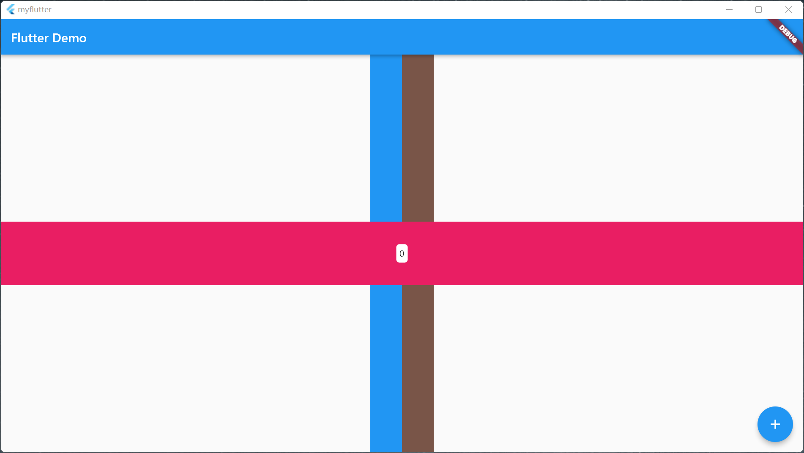
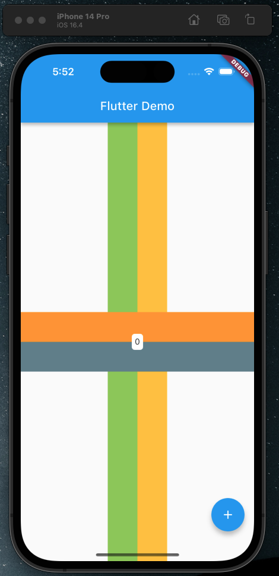
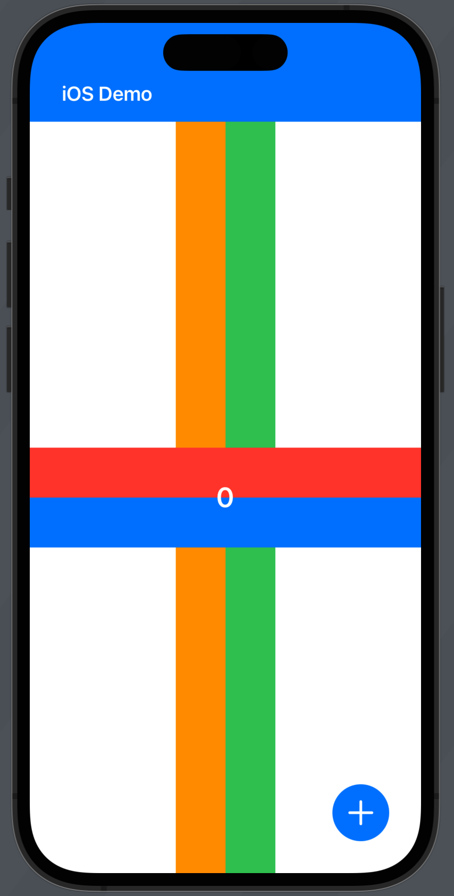

# MobileInit

## Flutter  -> Dart

1. Study Resource

   [中文文档](https://flutter.cn/docs)

   [依赖库](https://pub-web.flutter-io.cn/)

   [王叔不秃](https://space.bilibili.com/589533168?spm_id_from=333.337.0.0)

   《Flutter组件详解与实战》

2. Some Library

```dart
    get: ^4.6.5
    status_bar_control: ^3.2.1
    flutter_native_splash: ^2.2.19
    fluttertoast: ^8.1.2
    photo_view: ^0.14.0
    flutter_screenutil: ^5.6.0
    flutter_keyboard_visibility: ^5.4.0
    mmkv: ^1.2.14
    statusbarz: ^1.0.12
    path_provider: ^2.0.11
    path: ^1.8.0
    image_picker: ^0.8.5+3
    head_image_cropper: ^3.1.0
    badges: ^2.0.3
    path_provider: ^2.0.11
    path: ^1.8.0
    fluttertoast: ^8.0.7
    lottie: ^1.0.1
    panorama: ^0.4.1
    mmkv: ^1.2.14
    scrollview_observer: ^1.5.0
    spring: ^2.0.2
    animations: ^2.0.5 # flower
    printing: ^5.9.3
    flutter_typeahead: ^4.1.1
    pinch_zoom: ^1.0.0
    shape_of_view_null_safe: ^2.0.0
    showcaseview: ^2.0.0+1
    google_mlkit_object_detection: ^0.6.0
    google_mlkit_commons: ^0.2.0
    camera: ^0.10.1
    adobe_xd: ^2.0.1
    touchable: ^1.0.2
    hand_signature: ^3.0.1
    pytorch_mobile: ^0.2.2
    pytorch_lite: ^1.1.2
    animator: ^3.2.0
    crypto: ^3.0.1
    convert: ^3.0.0
    flutter_screenutil: ^5.0.0+2
    flutter_local_notifications: ^8.0.0
    shared_preferences: ^2.0.6
    dio: ^4.0.6
    cookie_jar: ^3.0.1
    dio_cookie_manager: ^2.0.0
    cached_network_image: ^3.2.1
    badges: ^2.0.3
    intro_slider: ^3.0.9
    image_picker: ^0.8.5+3
    head_image_cropper: ^3.1.0
    permission_handler: ^10.0.0
    pull_to_refresh: ^2.0.0
    statusbarz: ^1.0.11
    photo_view: ^0.14.0
    video_player: ^2.4.7
    chewie: ^1.2.5
    flutter_keyboard_visibility: ^5.3.0
    auto_animated: ^3.1.0 # flower
    image_sequence_animator: ^2.0.0
    feedback: ^2.5.0
    pin_code_fields: ^7.4.0
    flutter_animated_dialog: ^2.0.1
    spring_button: ^2.0.0
    video_thumbnail: ^0.5.3
    better_player: ^0.0.83
    bruno: ^3.1.0
    webview_flutter: ^4.0.1
    flutter_bounceable: ^1.0.3
    introduction_screen: ^3.1.1
    liquid_swipe: ^3.0.0
    swipable_stack: ^2.0.0
    styled_widget: ^0.4.1
    styled_text: ^6.0.0
    shrink_sidemenu: ^2.0.0+2-null-safety
    model_viewer_plus: ^1.4.0
    carousel_slider: ^4.2.1
```


## Android  -> Kotlin

[Android官网](https://developer.android.google.cn/guide?hl=zh-cn)

[Jetpack Compose](https://developer.android.google.cn/jetpack?hl=zh-cn)

[Kotlin文档](https://book.kotlincn.net/text/home.html)

[扔物线](https://space.bilibili.com/27559447?spm_id_from=333.337.0.0)

## IOS  -> Swift

[Swift语言学习](http://www.swift51.com/swift5.1/)

[SwiftUI Tutorials](https://developer.apple.com/tutorials/swiftui)

[Technologies | Apple Developer Documentation](https://developer.apple.com/documentation/technologies)

[tca 框架](https://github.com/pointfreeco/swift-composable-architecture)

## Plugins

Android Studio


Xcode    "mac of lab"

## ScreenShot





